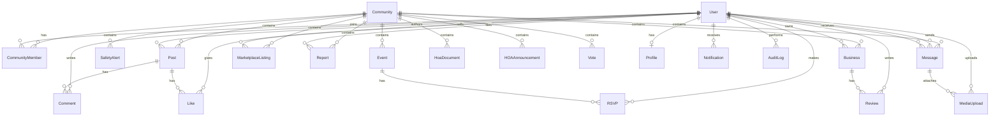

# Community Connect — Phase 1 Architecture

Phase 1 establishes the foundational scaffold: folder structure, database schema, auth/RBAC, layout shell, routing, and API patterns. Feature UIs and business logic are stubbed for Phase 2.

## Folder Structure

```
community-connect/
├── app/
│   ├── (auth)/              # Public auth pages (login, register)
│   │   ├── layout.tsx
│   │   ├── login/page.tsx
│   │   └── register/page.tsx
│   ├── (main)/              # Protected app shell (sidebar + mobile nav)
│   │   ├── layout.tsx
│   │   ├── dashboard/page.tsx
│   │   ├── feed/page.tsx
│   │   ├── alerts/page.tsx
│   │   ├── events/page.tsx
│   │   ├── marketplace/page.tsx
│   │   ├── services/page.tsx
│   │   ├── map/page.tsx
│   │   ├── hoa/page.tsx
│   │   ├── assistant/page.tsx
│   │   ├── admin/page.tsx
│   │   ├── profile/page.tsx
│   │   └── report/page.tsx
│   ├── api/
│   │   ├── auth/            # JWT cookie auth (Phase 1 — implemented)
│   │   ├── health/          # Health check (Phase 1 — implemented)
│   │   ├── v1/              # Versioned API stubs (Phase 2)
│   │   ├── posts/           # Feature stubs → 501
│   │   ├── alerts/
│   │   ├── events/
│   │   └── …
│   ├── layout.tsx           # Root layout + ThemeProvider
│   ├── page.tsx             # Minimal landing
│   └── globals.css
├── components/
│   ├── ui/                  # ShadCN-style primitives
│   ├── layout/              # AppShell, Sidebar, MobileNav, PlaceholderPage
│   └── providers/           # ThemeProvider
├── config/
│   ├── site.ts              # App metadata
│   ├── routes.ts            # Protected/admin route lists
│   └── navigation.ts        # Sidebar + mobile nav items
├── lib/
│   ├── auth/                # JWT, bcrypt, cookie name
│   ├── db/                  # Prisma client singleton
│   ├── api/                 # Auth guards, rate limit, response helpers, stubs
│   ├── permissions/         # RBAC role hierarchy
│   ├── realtime/            # Socket.io stub (Phase 2)
│   ├── validations.ts       # Zod schemas
│   └── utils.ts
├── hooks/
│   └── use-socket.ts        # Client socket stub
├── types/
│   └── index.ts
├── prisma/
│   ├── schema.prisma
│   ├── migrations/
│   └── seed.ts              # Minimal demo users + community
├── docs/
│   ├── ARCHITECTURE.md
│   └── API.md
└── middleware.ts            # Route protection + admin guard
```

Legacy re-exports at `lib/auth.ts`, `lib/prisma.ts`, `lib/rbac.ts`, `lib/api-auth.ts`, and `lib/rate-limit.ts` point to the new module paths for backward compatibility.

## Database Relationships

Multi-community support is modeled via `Community` + `CommunityMember`. Most content entities are scoped to a `communityId`.



### Key Models

| Model | Purpose |
|-------|---------|
| `Community` | Multi-tenant community container |
| `CommunityMember` | User ↔ community membership with per-community role |
| `User` / `Profile` | Auth identity + display profile |
| `Post`, `Comment`, `Like` | Community feed |
| `SafetyAlert` | Public safety notifications |
| `Event`, `RSVP` | Community events |
| `Business`, `Review` | Local services directory |
| `MarketplaceListing` | Buy/sell/trade |
| `Report` | Issue/hazard reporting |
| `Message` | Direct + community messaging |
| `Notification` | In-app notifications |
| `HoaDocument`, `HOAAnnouncement`, `Vote` | HOA portal |
| `MediaUpload` | File upload tracking |
| `AuditLog` | Security audit trail |

## Routing Map

| Route | Group | Auth | Phase 1 |
|-------|-------|------|---------|
| `/` | public | — | Minimal landing |
| `/login`, `/register` | `(auth)` | — | Functional forms |
| `/dashboard` | `(main)` | required | Placeholder |
| `/feed` | `(main)` | required | Placeholder |
| `/alerts` | `(main)` | required | Placeholder |
| `/events` | `(main)` | required | Placeholder |
| `/marketplace` | `(main)` | required | Placeholder |
| `/services` | `(main)` | required | Placeholder |
| `/map` | `(main)` | required | Placeholder |
| `/hoa` | `(main)` | required | Placeholder |
| `/assistant` | `(main)` | required | Placeholder |
| `/admin` | `(main)` | MODERATOR+ | Placeholder |
| `/profile` | `(main)` | required | Placeholder |
| `/report` | `(main)` | required | Placeholder |

### API Routes

| Endpoint | Phase 1 |
|----------|---------|
| `POST /api/auth/login` | Implemented |
| `POST /api/auth/register` | Implemented |
| `POST /api/auth/logout` | Implemented |
| `GET /api/auth/me` | Implemented |
| `GET /api/auth/oauth/[provider]` | 501 stub |
| `GET /api/health` | Implemented |
| `GET /api/v1` | Version index |
| `/api/posts`, `/api/alerts`, … | 501 stubs |
| `/api/v1/communities`, `/api/v1/messages` | 501 stubs |

## Frontend ↔ Backend Connection

1. **Auth flow**: Login/register forms POST to `/api/auth/*`. Server validates credentials via Prisma, signs a JWT, and sets an httpOnly `cc_token` cookie.
2. **Route protection**: `middleware.ts` reads the cookie, verifies JWT, and redirects unauthenticated users to `/login`. Admin routes additionally check role.
3. **API guards**: Route handlers use `requireAuth()` from `lib/api/auth.ts` for Bearer token or cookie auth, with optional minimum role via RBAC.
4. **Data fetching (Phase 2)**: Client components will fetch JSON from `/api/*` or `/api/v1/*`. Phase 1 pages are static placeholders — no data fetching.
5. **Theme**: `ThemeProvider` wraps the app; CSS variables in `globals.css` drive dark/light mode.

## Phase 1 vs Phase 2

### Implemented (Phase 1)

- Full Prisma schema + migration
- JWT auth (login, register, logout, me)
- RBAC permission helpers
- Middleware route guards
- App shell (header, sidebar, mobile bottom nav)
- Dark/light theme toggle
- ShadCN-style UI primitives
- Placeholder pages for all main sections
- Health check API
- `.env.example` with documented variables
- Minimal seed (demo community + users)

### Stubbed (Phase 2)

- Feature API handlers (posts, alerts, events, marketplace, etc.)
- OAuth providers
- AI assistant (`lib/ai.ts` retained but unused)
- Realtime socket server (`lib/realtime/`)
- File upload to S3
- Google Maps integration
- Full feature page UIs
- Demo data on landing page

## Phase 2 Prep Notes

1. Replace `phase2Stub()` handlers with Prisma queries scoped by `communityId`.
2. Add community context middleware/header (`X-Community-Id` or session default).
3. Wire `useSocket()` to Socket.io for live alerts and messaging.
4. Implement `/api/v1/*` as the canonical versioned surface; deprecate unversioned routes.
5. Add pagination helpers in `lib/api/response.ts`.
6. Run `npm run db:migrate && npm run db:seed` against a PostgreSQL instance before testing auth.
