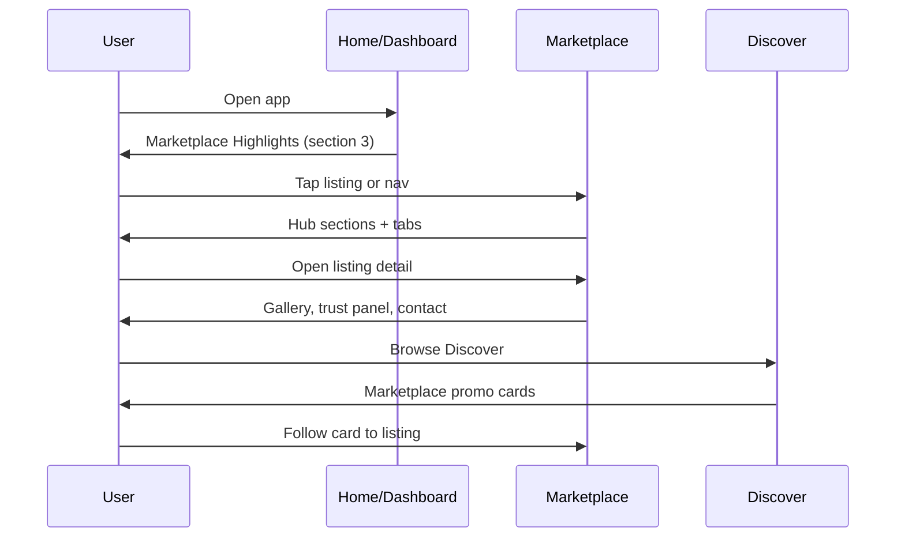

# Phase 10 Revision — Marketplace Expansion

User engagement revision preserving all Marketplace functionality from Phases 2, 5, and 10 while elevating Marketplace to a primary navigation destination.

## Navigation Structure

### Primary Sidebar (top-weight items first)

| Item | Route | Notes |
|------|-------|-------|
| Home | `/dashboard` | Lifestyle hub |
| Discover | `/discover` | Personalized feed |
| **Marketplace** | `/marketplace` | **Top-level, custom icon** |
| Groups | `/groups` | |
| Events | `/events` | |
| Alerts | `/alerts` | |
| Messages | `/messages` | |
| Profile | `/profile` | |
| Admin | `/admin` | Role-gated |

Secondary items (Community, Family, News, Challenges, Rewards, Deals, Services, Map, HOA, Settings, AI Assistant) remain in sidebar below primary items.

### Mobile Bottom Nav (5 items)

**Choice: Home | Discover | Marketplace | Groups | Profile**

Events, Alerts, Messages, and Map moved to **sidebar drawer** (`secondaryNav` in `config/navigation.ts`). This keeps Marketplace at equal visual weight on mobile without exceeding the 5-tab limit.

Deals live **inside** the Marketplace hub as a "Community Deals" section — `/deals` route preserved for direct access via sidebar.

## Marketplace Information Architecture

```mermaid
flowchart TB
  MP[Marketplace Hub /marketplace]
  MP --> Search[Search Hero + Location + Map/Grid toggle]
  MP --> Tabs{Hub Tabs}
  Tabs --> BS[Buy/Sell]
  Tabs --> CL[Classifieds]
  Tabs --> SV[Services]
  Tabs --> JB[Jobs]
  Tabs --> BZ[Businesses]

  BS --> Featured[Featured Listings]
  BS --> Recent[Recently Posted]
  BS --> Nearby[Nearby Listings]
  BS --> Trending[Trending Listings]
  BS --> Deals[Community Deals → /deals]
  BS --> BizRow[Local Businesses]
  BS --> SvcRow[Service Providers]
  BS --> JobsPreview[Job Opportunities]
  BS --> Give[Community Giveaways]
  BS --> Want[Wanted Requests]

  CL --> GS[Garage Sales]
  CL --> ES[Estate Sales]
  CL --> MS[Moving Sales]
  CL --> LF[Lost & Found]
  CL --> GW[Giveaways]
  CL --> WR[Wanted]

  SV --> Quote[Request Quote UI]
  SV --> Full[/services directory]

  JB --> FT[Full-time]
  JB --> PT[Part-time]
  JB --> Gig[Gig]
  JB --> Vol[Volunteer]

  BZ --> Reviews[Reviews + Promotions]
```

## User Flows



## Icon Design Spec

**File:** `components/icons/marketplace-icon.tsx`

| Export | Size | Use |
|--------|------|-----|
| `SidebarIcon` | 16px | Desktop sidebar |
| `MobileNavIcon` | 20px | Mobile bottom nav |
| `BadgeIcon` | 14px | Inline badges |
| `AppAccentIcon` | 32px | Marketing/accent |

**Design:** Line-art storefront awning + location pin + shopping bag, rounded strokes.

**Colors:**
- Primary: `#2563EB`
- Secondary: `#111827`
- Accent: `#10B981`

**Variants:** `default`, `dark`, `light`, `mono`

## Monetization Placeholders

- **Featured listings** — `featured` / `promoted` flags on listings; Featured row at top of hub
- **Promoted jobs** — extend job cards with promoted badge (future)
- **Business spotlight** — Local Businesses row with verified badges
- **Deal partnerships** — Community Deals section links to `/deals` redemption flow

## Preserved vs Expanded

### Preserved (Phases 2, 5, 10)

- [x] Buy/sell listings with create, search, favorites
- [x] Classifieds category support
- [x] Jobs tab with `/api/jobs` wiring
- [x] Businesses with reviews via `/api/businesses`
- [x] Services directory at `/services`
- [x] Inquiry forms and share/favorite APIs
- [x] Map integration link (`/map?layer=listings`)
- [x] Deals route `/deals` (not replacing Marketplace nav)
- [x] Promotions via deal cards
- [x] Admin marketplace queue (unchanged)

### Expanded (Phase 10 Revision)

- [x] Marketplace as primary nav with custom SVG icon
- [x] Full marketplace hub with 10 content sections
- [x] Hub tabs: Buy/Sell | Classifieds | Services | Jobs | Businesses
- [x] Multi-photo gallery on listing detail modal
- [x] Seller reputation scores and verified badges (mock)
- [x] Trust panel with safe meetup placeholder + report scam
- [x] Mark sold / renew listing UI stubs
- [x] Follow seller + share listing
- [x] Grid/list view toggle + sticky mobile search
- [x] Marketplace promo cards in Discover feed
- [x] Marketplace Highlights on Home dashboard
- [x] AI marketplace recommendations in lifestyle engine
- [x] Expanded mock data (15 listings, classified types, sellers)

## Key Files

| Area | Path |
|------|------|
| Navigation | `config/navigation.ts` |
| Icon | `components/icons/marketplace-icon.tsx` |
| Hub page | `app/(main)/marketplace/page.tsx` |
| Components | `components/marketplace/*` |
| Mock data | `lib/mock-data/marketplace.ts` |
| Fallback API | `lib/api/fallback-marketplace.ts` |
| AI recs | `lib/ai/lifestyle-recommendations.ts` |
| Discover promos | `lib/mock-data/discover.ts` |
| Dashboard | `app/(main)/dashboard/page.tsx` |
