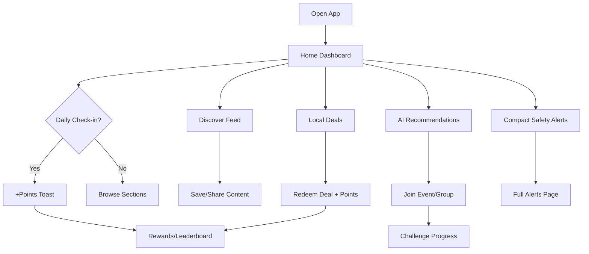

# Phase 10: User Engagement & Lifestyle Development

Phase 10 transforms Community Connect from a safety-first platform into a daily lifestyle hub — driving DAU, retention, discovery, and community participation while keeping safety alerts accessible but not dominant.

## Engagement Strategy

### Goals
- **DAU**: Daily check-ins, personalized home feed, and "What to do tonight" recommendations
- **Retention**: Streaks, points, achievements, and community challenges
- **Social**: Groups, activity feed, friend actions
- **Discovery**: TikTok/Nextdoor-style discover feed with personalization
- **Lifestyle**: Deals, family hub, local news, events

### Safety Balance
Safety alerts remain on the home screen as a **compact panel** (max 2 alerts), not a hero section. Full alerts accessible via sidebar/drawer secondary nav.

## Schema Summary

Migration: `20250530120000_phase10_engagement`

| Model | Purpose |
|-------|---------|
| `CommunityGroup` | Interest groups (name, category, coverPhoto, memberCount, isPrivate) |
| `GroupMember` | Membership with MODERATOR/MEMBER roles |
| `GroupPost` | Group content linked to Post or standalone |
| `LocalDeal` | Business deals with discount, dealType, expiresAt |
| `SavedDeal` | User saved deals |
| `DealRedemption` | Redemption stub with code |
| `CommunityPoints` | User balance and level |
| `PointTransaction` | Point ledger with reason enum |
| `Achievement` / `UserAchievement` | Badges and earned state |
| `CommunityChallenge` / `ChallengeParticipation` | Community goals with progress |
| `NewsArticle` | Local news with category and summary |
| `UserInterest` | Topic tags for personalization |
| `DailyCheckIn` | Daily check-in with streak |
| `TrendingItem` | Scored trending entities by period |
| `PersonalizationProfile` | JSON interests + preferences |

## API Routes

| Method | Route | Description |
|--------|-------|-------------|
| GET | `/api/discover/feed` | Personalized discovery feed |
| GET/POST | `/api/groups` | List/create groups |
| GET | `/api/groups/[id]` | Group detail + posts |
| POST | `/api/groups/[id]/join` | Join group |
| POST | `/api/groups/[id]/leave` | Leave group |
| GET | `/api/deals` | Local deals (`?expiringSoon=true`) |
| POST | `/api/deals/[id]/save` | Save deal |
| POST | `/api/deals/[id]/redeem` | Redeem stub (+ points) |
| GET | `/api/rewards/points` | User points/level/streak |
| GET | `/api/rewards/leaderboard` | Community leaderboard |
| GET | `/api/rewards/achievements` | Achievements list |
| POST | `/api/rewards/check-in` | Daily check-in + streak |
| GET | `/api/news` | Local news articles |
| GET | `/api/news/trending` | Trending news |
| GET | `/api/challenges` | Community challenges |
| POST | `/api/challenges/[id]/join` | Join challenge |
| GET | `/api/trending` | Trending items |
| GET | `/api/recommendations/lifestyle` | "What to do tonight" cards |
| GET/PATCH | `/api/personalization/profile` | Interests profile |
| GET | `/api/admin/engagement` | Admin engagement metrics stub |

All routes use mock data fallback when DB unavailable (development).

## Pages

| Route | Description |
|-------|-------------|
| `/dashboard` | Redesigned lifestyle home (10 sections) |
| `/discover` | Infinite scroll discovery feed |
| `/groups` | Group directory |
| `/groups/[id]` | Group detail with posts |
| `/deals` | Deals marketplace |
| `/family` | Family Hub (school, sports, camps) |
| `/news` | Local News Hub with AI summaries |
| `/challenges` | Community challenges + leaderboard |
| `/rewards` | Points, badges, achievements |

## Navigation

### Mobile Bottom Nav (lifestyle-first)
```
Home | Discover | Groups | Deals | Profile
```

### Secondary Nav (sidebar — Alerts/Map still accessible)
```
Alerts | Map | Community | Rewards
```

See `config/navigation.ts` for `mobileNav`, `sidebarNav`, and `secondaryNav`.

## User Journey



## Personalization Architecture

1. **UserInterest** + **PersonalizationProfile** store topic tags and preferences
2. **getDiscoverFeed** scores items by interest match (+10 per keyword hit)
3. **getLifestyleRecommendations** uses rule-based engine (time of day, interests)
4. OpenAI stub when `OPENAI_API_KEY` set — falls back to rules
5. Settings page: interest tag selection via PATCH `/api/personalization/profile`

## Gamification

- **Points**: Check-in (+10–45), deal redemption (+25), challenges (+50)
- **Levels**: Thresholds at 100, 300, 600, 1000, 1500…
- **Streaks**: Daily check-in consecutive days
- **Achievements**: first_post, week_streak, local_hero, deal_hunter, etc.
- **Leaderboard**: Top users by point balance
- **UI**: Points toast on actions, profile shows level/streak, FAB for post/check-in

## Recommendation Engine

Rule-based "What should I do tonight?" (`lib/ai/lifestyle-recommendations.ts`):

| Input | Output |
|-------|--------|
| interests: food, hour ≥ 17 | Dining/happy hour card |
| interests: family | Family activities |
| interests: outdoors | Parks/hikes (weather-aware stub) |
| interests: deals | Expiring deals |
| interests: social | Group activity |

## Monetization Opportunities

- **Sponsored deals**: Featured placement in `/deals` and home "Local Deals" row
- **Featured businesses**: Promoted in "Nearby Businesses" and discover feed
- **Premium groups**: Private groups with subscription (schema supports `isPrivate`)
- **Challenge sponsors**: Local business-sponsored community challenges
- **News partnerships**: Sponsored local news categories

## Home Screen Design Notes

Sections in order (alerts de-emphasized):
1. Welcome + weather
2. Daily check-in CTA
3. Today's events (horizontal scroll)
4. Local deals row
5. Trending strip
6. AI recommendations ("What to do tonight")
7. Friends & activity feed
8. Local news strip
9. Family activities
10. Trending community posts
11. Nearby businesses
12. Compact safety alerts panel

Uses Framer Motion, `CommunityImage`, horizontal scroll rows, and quick-action FAB.

## Demo Flows

1. **Check-in streak**: Home → Daily Check-in → +points toast → `/rewards`
2. **Discover**: `/discover` → filter by deals → save/share cards
3. **Deals**: `/deals` → save deal → redeem → points toast
4. **Groups**: `/groups` → join "Oak Hills Runners" → view posts
5. **Challenges**: `/challenges` → join cleanup week → see leaderboard
6. **Personalization**: Settings → Interests → save → refresh home recommendations
7. **Admin**: `/admin` → Engagement tab → DAU/retention metrics

## Seed Data

Run `npm run db:seed` after migration. Demo users get:
- **resident@communityconnect.app**: 1240 pts, level 5, 7-day streak, 2 achievements
- **sarah@communityconnect.app**: 3420 pts, level 8 (leaderboard #1)
- Groups, deals, challenges, news, trending items for Oak Hills community
