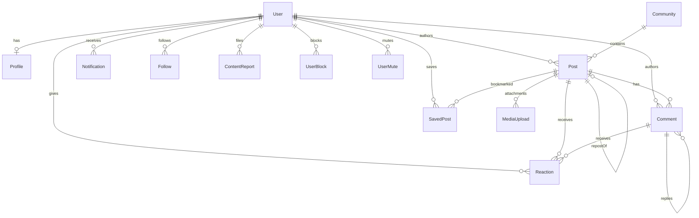

# Phase 3 — Backend, Database, API & Realtime

Phase 3 wires the Phase 2 UI to production-quality APIs backed by PostgreSQL (Prisma), with Socket.io realtime and graceful mock fallback when the database is unavailable in development.

## ER Diagram



## Schema Changes Summary

| Model / Enum | Change |
|--------------|--------|
| `PostType` | NEW: TEXT, IMAGE, VIDEO, POLL |
| `ReactionType` | NEW: LIKE, HELPFUL, SUPPORT, ALERT_ACK |
| `FollowTargetType` | NEW: USER, BUSINESS, COMMUNITY, TOPIC |
| `ContentReport` | NEW moderation flags |
| `ContentEntityType` / `ContentReportStatus` | NEW enums |
| `Post` | type, hashtags, mentions, lat/lng, locationLabel, pollData, repostOfId |
| `Comment` | parentId (nested replies), updatedAt |
| `Like` | **Removed** → replaced by `Reaction` |
| `Reaction` | NEW — on posts and comments |
| `Follow` | NEW — polymorphic follow targets |
| `SavedPost` | NEW bookmarks |
| `UserBlock` / `UserMute` | NEW |
| `NotificationType` | Extended: LIKE, COMMENT, REPLY, MENTION, FOLLOW, MARKETPLACE |
| `MediaUpload` | postId relation |
| Indexes | communityId+createdAt, communityId+category+createdAt, feed performance |

Migration: `prisma/migrations/20250529120000_phase3_social/`

## API Endpoints

| Method | Path | Auth | Description |
|--------|------|------|-------------|
| GET | `/api/posts` | Yes* | Feed (latest/trending, category, cursor pagination) |
| POST | `/api/posts` | Yes | Create post (text/image/video/poll) |
| GET | `/api/posts/[id]` | Optional | Single post |
| PATCH | `/api/posts/[id]` | Yes | Update own post |
| DELETE | `/api/posts/[id]` | Yes | Delete own post |
| POST | `/api/posts/[id]/share` | Yes | Repost/share |
| GET | `/api/posts/[id]/comments` | Yes | List comments (optional parentId) |
| POST | `/api/posts/[id]/comments` | Yes | Create comment/reply |
| PATCH | `/api/comments/[id]` | Yes | Edit own comment |
| DELETE | `/api/comments/[id]` | Yes | Delete own comment |
| POST | `/api/posts/[id]/reactions` | Yes | Toggle reaction |
| DELETE | `/api/posts/[id]/reactions` | Yes | Remove reaction |
| POST | `/api/comments/[id]/reactions` | Yes | Toggle comment reaction |
| DELETE | `/api/comments/[id]/reactions` | Yes | Remove comment reaction |
| GET | `/api/notifications` | Yes | List notifications (cursor) |
| PATCH | `/api/notifications` | Yes | Mark read / mark all read |
| POST | `/api/users/[id]/follow` | Yes | Follow user/business/community/topic |
| DELETE | `/api/users/[id]/follow` | Yes | Unfollow |
| GET | `/api/users/[id]/follow?list=followers\|following` | Yes | Follow lists |
| GET | `/api/users/[id]` | Yes | User profile |
| GET | `/api/users/[id]?section=activity` | Yes | User activity (posts) |
| POST | `/api/posts/[id]/save` | Yes | Bookmark post |
| DELETE | `/api/posts/[id]/save` | Yes | Remove bookmark |
| GET | `/api/posts/saved` | Yes | Saved posts |
| POST | `/api/upload` | Yes | Upload image/video/pdf |
| GET | `/api/search?q=` | Yes | Search posts, users, hashtags |
| POST | `/api/content-reports` | Yes | Report content |
| GET | `/api/admin/moderation` | MODERATOR+ | Moderation queue stub |

\* GET `/api/posts` returns mock data in dev when unauthenticated or DB offline.

## Feed Ranking

**Latest** (default): `ORDER BY createdAt DESC` with cursor pagination.

**Trending**: Posts from the last 7 days scored as:

```
score = reaction_count + (comment_count × 2)
```

Sorted by score descending, then `createdAt` descending. Implemented in `lib/api/services/posts.ts`.

## Realtime Architecture

```
┌─────────────┐     JWT auth      ┌──────────────────┐
│   Client    │◄─────────────────►│  Socket.io       │
│ useSocket() │   /api/socket     │  (custom server) │
└──────┬──────┘                   └────────┬─────────┘
       │                                   │
       │  post:new                         │ emitToCommunity()
       │  comment:new                      │ emitToUser()
       │  reaction:update                  │
       │  notification:new                 ▼
       │                          ┌──────────────────┐
       └─────────────────────────►│  API Routes      │
                                  │  (Next.js)       │
                                  └──────────────────┘
```

### Socket Events

| Event | Direction | Payload |
|-------|-----------|---------|
| `post:new` | Server → Client | `FeedPost` |
| `comment:new` | Server → Client | `{ postId, comment }` |
| `reaction:update` | Server → Client | `{ postId, counts, userId, action, type }` |
| `notification:new` | Server → Client | `Notification` |
| `join:community` | Client → Server | `communityId` |

### Vercel Limitation

Socket.io requires a persistent HTTP server. Use:

- **Development:** `npm run dev:socket` (custom server via `server.ts`)
- **Production/Vercel:** Deploy a separate socket service, or use polling/SSE fallback (Phase 4). Standard `next dev` / Vercel serverless does not support WebSockets on the same process.

## Upload Flow

1. Client POSTs `multipart/form-data` to `/api/upload` with `file` field
2. `validateUpload()` checks MIME (jpeg/png/webp/gif/mp4/webm/pdf) and size (10MB max)
3. `storeUpload()` writes to `public/uploads/` locally, or S3 when `STORAGE_PROVIDER=s3`
4. `MediaUpload` record created in DB with optional `postId` linkage

## Moderation Workflow

1. User submits `POST /api/content-reports` with entityType, entityId, reason
2. Report enters `PENDING` queue
3. Moderators fetch `GET /api/admin/moderation` (stub — review actions in Phase 4)
4. `UserBlock` / `UserMute` models ready for enforcement hooks

## Security

- **JWT:** All protected routes use `requireAuth()` from `lib/api/auth.ts`
- **XSS:** `sanitizeText()` on user content fields
- **Upload:** MIME whitelist + size limits
- **Rate limiting:** `lib/api/rate-limit.ts` on writes (posts, comments, reactions, uploads)
- **CSRF:** HttpOnly `cc_token` cookie with `SameSite=Lax` — no CSRF token needed for same-site API calls

## Graceful Degradation

When PostgreSQL is unreachable:

- Login still works via demo users (`lib/auth/demo-users.ts`)
- GET `/api/posts` and `/api/notifications` fall back to mock data in development
- UI shows "Demo data (DB offline)" badge on feed

## Frontend Integration

| Page / Component | Integration |
|------------------|-------------|
| `/feed` | `useFeed()` hook, cursor infinite scroll, `PostComposer` |
| `FeedPostCard` | API reactions, save, share, comments panel |
| `AppHeader` | `useNotifications()` real-time bell dropdown |
| `useSocket` | Socket.io client with JWT from cookie |

## Testing

```bash
chmod +x scripts/test-api.sh
npm run dev:socket   # terminal 1
./scripts/test-api.sh  # terminal 2 (after login cookie)
```

## Development

```bash
cd community-connect
cp .env.example .env   # set DATABASE_URL
npm run db:migrate
npm run db:seed
npm run dev:socket     # with realtime
# or npm run dev        # API only, no websockets
```

## Phase 4 Prep (stubs only)

- **Alerts/Maps:** `SafetyAlert` model exists; `/api/alerts` remains Phase 2 stub
- **Moderation actions:** Queue read-only; approve/remove in Phase 4
- **Location on posts:** Schema ready (`lat`, `lng`); UI placeholder in composer
- **Google Maps:** Replace `MapPlaceholder` per PHASE2.md
