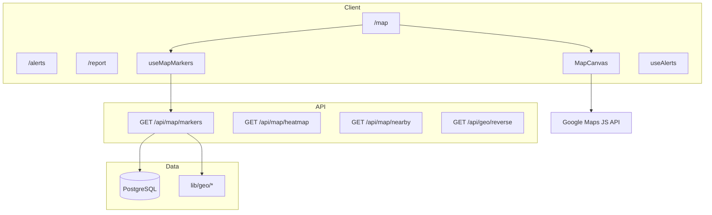
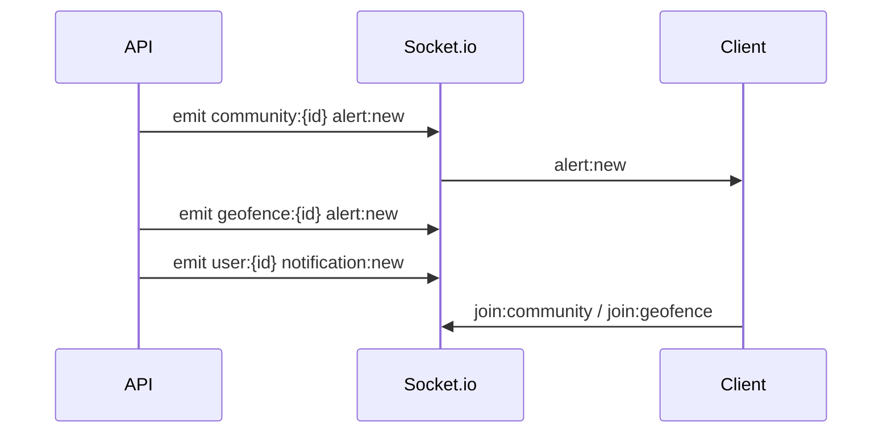
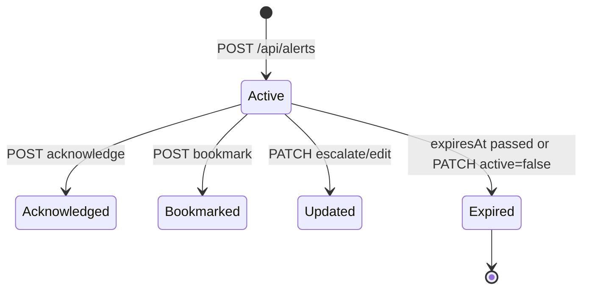

# Phase 4 — Safety, Maps, Geolocation & Realtime

Phase 4 delivers production-quality safety operations: enhanced Prisma models, REST APIs, Socket.io realtime, Google Maps integration (with graceful fallback), geofencing, and admin safety tooling.

## Map Architecture

## Realtime Event Flow

| Event | Room | Payload |
|-------|------|---------|
| `alert:new` | `community:*`, `geofence:*` | `SafetyAlertDto` |
| `alert:update` | `community:*` | `SafetyAlertDto` |
| `alert:severity` | `community:*` | `{ id, severity, title }` |
| `report:new` | `community:*` | `IncidentReportDto` |
| `report:status` | `community:*`, `user:reporter` | `IncidentReportDto` |
| `map:marker:update` | `community:*` | `{ action, marker }` |

## Geolocation System

- **Haversine** distance and radius filter (`lib/geo/distance.ts`)
- **BBox** pre-filter for API performance before precise radius check
- **Point-in-polygon** for geofence zones (`lib/geo/polygon.ts`)
- **Reverse geocode** via Google when `GOOGLE_MAPS_KEY` is set, else coordinate placeholder

## Alert Lifecycle

## Geofencing Logic

1. Zones defined as **radius** (`centerLat`, `centerLng`, `radiusM`) or **polygon** JSON.
2. On alert create, `findGeofenceRoomsForPoint` resolves matching zones.
3. Broadcast to `geofence:{zoneId}` rooms and notify `AlertSubscription` users.
4. Users subscribe via `POST /api/geofences/[id]/subscribe` or radius-based subscriptions.

## Schema Summary

| Model | Purpose |
|-------|---------|
| `SafetyAlert` | category, severity (INFO→CRITICAL), radiusM, acknowledgments |
| `Report` | incident categories, severity, anonymous, assignment |
| `GeofenceZone` | HOA / EMERGENCY / WATCH zones |
| `AlertSubscription` | per-user zone or radius prefs |
| `AlertAcknowledgment` | user acknowledged alert |
| `AlertBookmark` | saved alerts |
| `WatchArea` | user saved watch zones |
| `LocationHistory` | optional private location log |
| `MapLayerPreference` | per-user layer toggles |

Migration: `prisma/migrations/20250529140000_phase4_safety/`

## API Endpoint Table

| Method | Path | Auth | Description |
|--------|------|------|-------------|
| GET | `/api/alerts` | Optional* | List/filter alerts |
| POST | `/api/alerts` | PUBLIC_SAFETY+ | Create alert |
| GET/PATCH | `/api/alerts/[id]` | Yes / PS+ | Detail / update |
| POST | `/api/alerts/[id]/acknowledge` | Yes | Acknowledge |
| POST/DELETE | `/api/alerts/[id]/bookmark` | Yes | Bookmark |
| GET/POST | `/api/reports` | Yes | List / submit incident |
| GET/PATCH | `/api/reports/[id]` | Yes / Mod+ | Detail / status |
| POST | `/api/reports/[id]/media` | Yes | Attach media |
| GET | `/api/map/markers` | Optional* | Layer markers (bbox) |
| GET | `/api/map/heatmap` | Yes | Aggregated heat points |
| GET | `/api/map/nearby` | Yes | Nearby by type |
| GET | `/api/geo/reverse` | Public | Reverse geocode |
| GET | `/api/geo/near-me/[type]` | Yes | Near-me alerts/events/services |
| GET/POST | `/api/geofences` | Yes / Mod+ | List / create zones |
| POST | `/api/geofences/[id]/subscribe` | Yes | Subscribe |
| GET/POST | `/api/watch-areas` | Yes | Saved watch areas |
| GET/POST | `/api/admin/alerts` | MODERATOR+ | Admin alert CRUD |
| GET | `/api/admin/reports/queue` | MODERATOR+ | Moderation queue |
| GET | `/api/admin/analytics/safety` | MODERATOR+ | Safety analytics |

\* Dev mock fallback when DB unavailable.

## Environment Variables

| Variable | Required | Purpose |
|----------|----------|---------|
| `DATABASE_URL` | Yes (prod) | PostgreSQL |
| `NEXT_PUBLIC_GOOGLE_MAPS_KEY` | No | Client map rendering |
| `GOOGLE_MAPS_KEY` | No | Server reverse geocoding |
| `JWT_SECRET` | Yes | Auth + sockets |

## Phase 5 Prep

- Wire `lib/ai/incident-categorization.ts` to LLM provider
- Marker clustering (`@googlemaps/markerclusterer`)
- Push notifications (FCM/APNs) for geofence triggers
- Marketplace / payment integrations (out of Phase 4 scope)
- Full viewport-driven marker pagination on map pan/zoom

## Demo Accounts (seed)

| Email | Role | Password |
|-------|------|----------|
| `demo@communityconnect.app` | ADMIN | `Demo1234!` |
| `safety@communityconnect.app` | PUBLIC_SAFETY | `Demo1234!` |
| `resident@communityconnect.app` | RESIDENT | `Demo1234!` |

Run: `npm run db:migrate && npm run db:seed`
