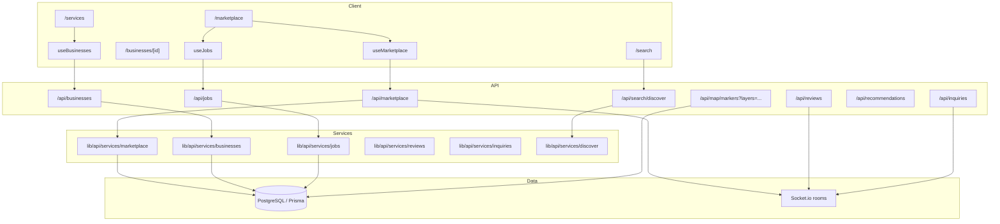
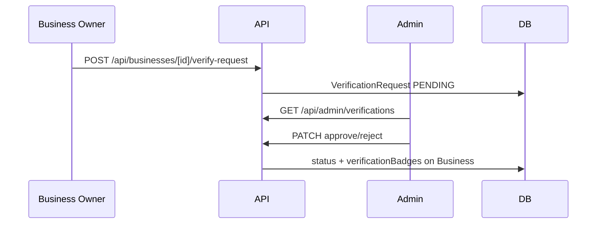

# Phase 5 — Marketplace, Business Directory & Local Economy

Phase 5 delivers a production-quality local marketplace: listings, business profiles, jobs, reviews, inquiries, verification, search/discovery, map layers, and realtime updates — with demo fallbacks when the database is offline.

## Marketplace Architecture

## Search System

| Endpoint | Purpose |
|----------|---------|
| `GET /api/search/marketplace` | Listing search with price, radius, category filters |
| `GET /api/search/businesses` | Business name/category search |
| `GET /api/search/discover` | Unified listings + businesses + jobs |
| `GET /api/recommendations` | Rule-based nearby, trending, verified businesses |

Discovery uses community-scoped Prisma queries with optional Haversine radius filtering (same geo utilities as Phase 4).

## Verification Flow

Verification types: `IDENTITY`, `LICENSE`, `COMMUNITY`, `PUBLIC_SAFETY`, `HOA`.

## Review Moderation

- One review per user per business (unique constraint)
- `ReviewModerationStatus`: PENDING, APPROVED, FLAGGED, REMOVED
- Helpful votes via `ReviewHelpfulVote`; reports via `ReviewReport`
- Owner responses stored on `Review.ownerResponse`
- Rate limit: 5 reviews/minute per client

## API Reference (Phase 5)

| Method | Route | Auth | Description |
|--------|-------|------|-------------|
| GET/POST | `/api/marketplace` | Yes | List/create listings |
| GET/PATCH/DELETE | `/api/marketplace/[id]` | Yes | CRUD single listing |
| POST/DELETE | `/api/marketplace/[id]/favorite` | Yes | Toggle favorite |
| GET | `/api/marketplace/favorites` | Yes | User listing favorites |
| POST | `/api/marketplace/[id]/share` | Yes | Share stub |
| GET/POST | `/api/businesses` | Yes | Directory / create |
| GET/PATCH | `/api/businesses/[id]` | Yes | Profile / update |
| GET/POST | `/api/businesses/[id]/reviews` | Yes | Reviews |
| GET | `/api/businesses/[id]/analytics` | Yes | View/inquiry stats |
| POST | `/api/businesses/[id]/inquiry` | Yes | Contact / quote |
| POST/DELETE | `/api/businesses/[id]/favorite` | Yes | Favorite business |
| POST/DELETE | `/api/businesses/[id]/follow` | Yes | Follow business |
| POST | `/api/businesses/[id]/verify-request` | Owner | Request verification |
| GET/POST | `/api/reviews` | Yes | Create review |
| PATCH/DELETE | `/api/reviews/[id]` | Yes | Edit/remove |
| POST | `/api/reviews/[id]/helpful` | Yes | Helpful vote |
| POST | `/api/reviews/[id]/report` | Yes | Report review |
| GET/POST | `/api/jobs` | Yes | Job board |
| GET/PATCH/DELETE | `/api/jobs/[id]` | Yes | Job CRUD |
| POST | `/api/jobs/[id]/apply` | Yes | Apply (creates inquiry) |
| GET/POST | `/api/inquiries` | Yes | List/send inquiries |
| PATCH | `/api/inquiries/[id]` | Yes | Update status |
| GET | `/api/search/discover` | Yes | Unified search |
| GET | `/api/recommendations` | Yes | Nearby + trending |
| GET | `/api/admin/verifications` | Mod+ | Verification queue |
| PATCH | `/api/admin/verifications` | Mod+ | Approve/reject |
| GET | `/api/admin/marketplace/queue` | Mod+ | Flagged listings |
| PATCH | `/api/admin/listings/[id]/moderate` | Mod+ | Moderate listing |
| GET | `/api/map/markers?layers=businesses,listings,jobs` | Yes | Map markers |

## Realtime Events

| Event | Room | Payload |
|-------|------|---------|
| `listing:new` | `community:{id}` | `MarketplaceListingDto` |
| `listing:update` | `community:{id}` | `MarketplaceListingDto` |
| `listing:sold` | `community:{id}` | listing id |
| `review:new` | `community:{id}` | `ReviewDto` |
| `inquiry:new` | `user:{ownerId}` | `InquiryDto` |
| `business:activity` | `community:{id}` | activity payload |
| `map:marker:update` | `community:{id}` | `{ action, marker }` |

Rooms: `community:{id}`, `business:{id}`, `user:{id}`.

## Security

- Rate limits on listing, review, inquiry, and job apply creation
- Duplicate review prevention (DB unique + 409 response)
- Inquiry spam heuristics (link count, crypto keywords)
- Scam detection stub flags high-risk listings as PENDING
- RBAC: `BUSINESS_OWNER` for own resources; `MODERATOR`/`ADMIN` for queues

## Demo Fallback

When `DATABASE_URL` is unavailable in development, API routes return mock data from `lib/api/fallback-marketplace.ts` with `source: "mock"`. UI shows a demo banner.

## Phase 6 AI Prep

| Module | Status |
|--------|--------|
| `lib/ai/marketplace-categorization.ts` | Rule-based category suggestion |
| `lib/ai/scam-detection.ts` | Heuristic risk scoring |
| `lib/ai/recommendations.ts` | Nearby/trending rules; ML placeholder |

Phase 6 will add embeddings search, personalized recommendations, and automated moderation.

## Demo Accounts

| Email | Password | Role |
|-------|----------|------|
| `business@communityconnect.app` | `Demo1234!` | BUSINESS_OWNER (Oak Street Bakery, Green Thumb) |
| `resident@communityconnect.app` | `Demo1234!` | RESIDENT (listings, reviews) |
| `demo@communityconnect.app` | `Demo1234!` | ADMIN (moderation queues) |

Run: `npx prisma migrate deploy && npx prisma db seed`
