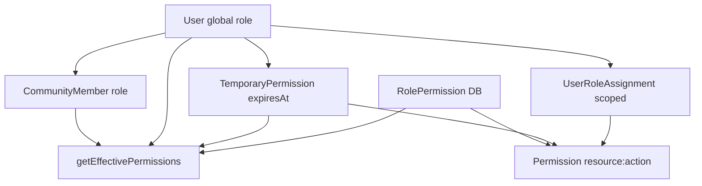
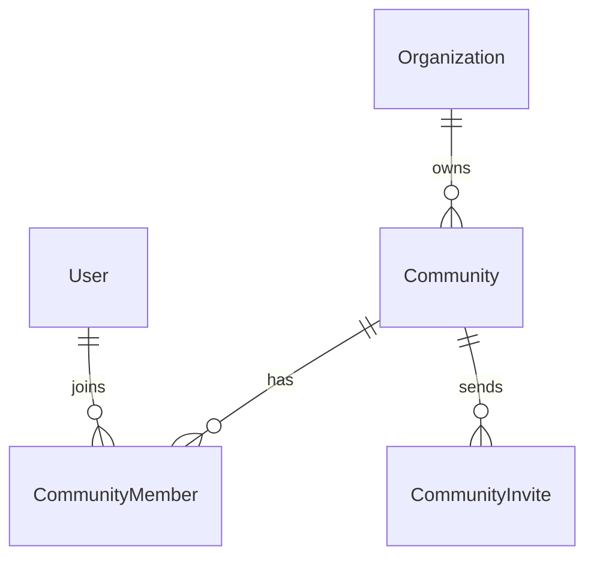
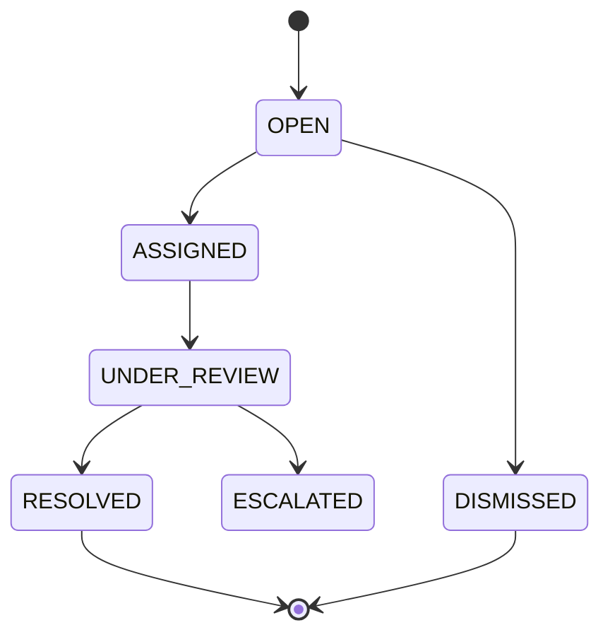

# Phase 7 — Enterprise Administration

Phase 7 adds multi-tenant community management, expanded RBAC, HOA workflows, public safety ops, moderation command center, analytics, audit logging, and enterprise broadcasts.

## RBAC architecture



- **SUPER_ADMIN** bypasses all permission checks (documented in `lib/permissions/rbac.ts`).
- Static defaults live in `ROLE_PERMISSIONS` (`lib/permissions/permissions.ts`).
- DB `RolePermission` and `TemporaryPermission` extend or override defaults.
- API routes use `requirePermissionAsync()` + Zod validation + rate limits.
- Sensitive actions call `writeAuditLog()` (`lib/api/services/audit.ts`).

## Multi-community structure



- Active community stored in cookie `cc_community` via `POST /api/communities/switch`.
- `getActiveCommunityId()` resolves cookie → membership → first active membership.
- Header **Community Switcher** lists `/api/communities`.

## Moderation workflow



- Unified queue: `ModerationCase`, `ContentReport`, flagged `MarketplaceListing`.
- `aiConfidence` field is a **placeholder** for future AI moderation (Phase 6 skipped).
- Realtime: `moderation:case:new`, `moderation:case:update` on `admin:{communityId}` rooms.

## Audit logging

| Field | Purpose |
|-------|---------|
| action | Dot-notation event e.g. `user.suspend` |
| resource / resourceId | Target entity |
| metadata | JSON context |
| ip | Client IP placeholder |
| communityId / organizationId | Tenant scope |

`AuditLogRetention` model holds per-org retention placeholder (default 365 days).

## Enterprise API routes (38)

| Area | Routes |
|------|--------|
| Admin overview | `GET /api/admin/overview`, `GET /api/admin/system-health` |
| Analytics | `GET /api/admin/analytics/{type}`, `GET /api/admin/analytics/export` |
| Communities | `GET/POST /api/communities`, `GET/PATCH /api/communities/[id]`, `POST .../invite`, `POST /api/communities/switch`, `GET/PATCH .../members` |
| HOA | `GET/POST /api/hoa/announcements`, `documents`, `votes`, `votes/[id]/cast`, `meetings`, `rules`, `maintenance-requests`, `violation-reports` |
| Ops | `GET /api/ops/incidents`, `PATCH /api/ops/incidents/[id]`, `GET /api/ops/dashboard`, `hotspots`, `timelines` |
| Moderation | `GET /api/admin/moderation/queue`, `GET/PATCH /api/admin/moderation/cases/[id]`, `POST .../notes`, `POST /api/admin/users/[id]/suspend`, `POST /api/admin/appeals` |
| Workflow | `GET/POST /api/tasks`, `PATCH /api/tasks/[id]`, `GET /api/workflows/cases` |
| Audit | `GET /api/admin/audit-logs`, `GET /api/admin/audit-logs/export` |
| Broadcasts | `GET/POST /api/admin/broadcasts`, `POST .../send` |
| Roles | `GET/POST/PATCH /api/admin/roles` |

## Analytics architecture

- Live aggregates from Prisma counts (`lib/api/services/analytics.ts`).
- Optional cache: `DailyCommunityMetrics`, `DailySafetyMetrics` (per community + date).
- Dev fallback: `lib/api/fallback-enterprise.ts` when DB is offline.
- UI uses CSS bar charts (no recharts dependency).

## Realtime (Socket.io)

| Event | Room |
|-------|------|
| `task:assigned` | `user:{assigneeId}` |
| `moderation:case:*` | `admin:{communityId}` |
| `broadcast:sent` | `community:{communityId}` |
| `ops:incident:update` | `ops:{communityId}` |

Clients join via `join:admin` and `join:ops` socket events.

## UI pages

| Path | Description |
|------|-------------|
| `/admin` | Enterprise tabbed control center |
| `/admin/ops` | Dispatch feed, assignment, hotspots |
| `/hoa` | Full HOA suite wired to APIs |

## Security placeholders

- `User.mfaEnabled` — MFA not implemented
- `UserSession` — session table placeholder
- CAD / body-cam — ops UI placeholders only

## Demo accounts (password `Demo1234!`)

| Email | Role |
|-------|------|
| demo@communityconnect.app | ADMIN |
| super@communityconnect.app | SUPER_ADMIN |
| safety@communityconnect.app | PUBLIC_SAFETY |
| dispatch@communityconnect.app | DISPATCHER |
| hoa@communityconnect.app | HOA_MANAGER |
| resident@communityconnect.app | RESIDENT |

## Phase 8 prep

- Production deployment hardening (env secrets, MFA, session store)
- AI moderation pipeline wiring to `aiConfidence`
- CSV export auth headers / signed URLs
- Horizontal scaling for Socket.io adapter
- Permission admin UI (assign `UserRoleAssignment` from dashboard)

## Migration

```bash
cd community-connect
npx prisma migrate deploy
npm run db:seed
npm run build
```

Migration: `20250529180000_phase7_enterprise`
