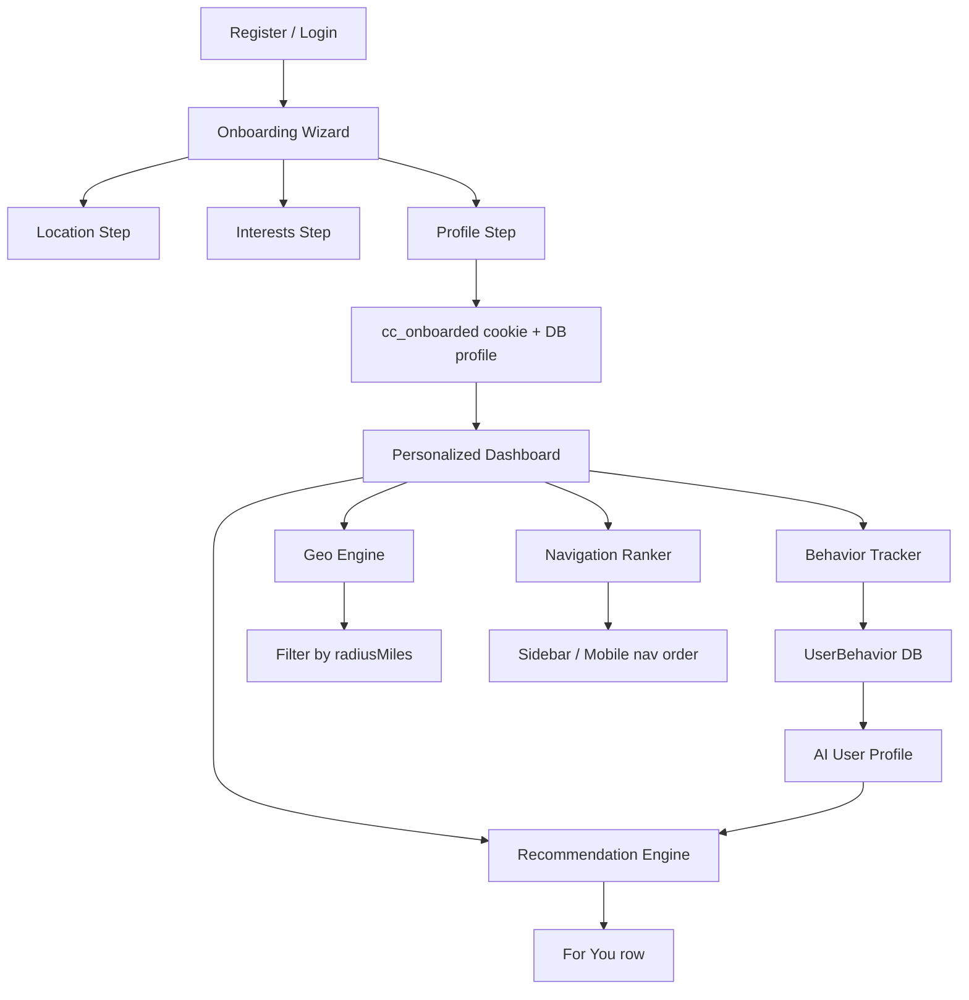

# Radius Onboarding & Personalization

Radius is the user-facing personalization layer for Community Connect — onboarding, geolocation, interests, dynamic navigation, and AI-assisted recommendations.

## Architecture Overview

## Data Models

| Model | Purpose |
|-------|---------|
| `User.username` | Optional unique handle |
| `Profile.firstName/lastName` | Registration names |
| `UserPreferences` | Notifications, privacy, `radiusMiles` (default 10), `menuLocked`, `navOrder` |
| `UserLocation` | lat/lng, city/state/zip, `precise`, `sharingEnabled`, `source` (GPS/MANUAL) |
| `SavedLocation` | Labeled saved places |
| `UserInterest` | Topic tags (existing, extended in seed) |
| `UserBehavior` | CLICK/VIEW/SEARCH/etc. for AI learning |
| `UserRecommendation` | Cached scored recommendations |
| `PersonalizationProfile` | JSON interests + `onboardingCompletedAt` + `aiProfileSummary` |

Migration: `20250531120000_radius_onboarding`

## Onboarding Flow

1. **Register** (`/register`) — email/password, optional username/photo, OAuth stubs (Google/Apple/Facebook)
2. **Location** (`/onboarding/location`) — browser geolocation + manual fallback
3. **Interests** (`/onboarding/interests`) — multi-select from `config/interests.ts`
4. **Profile** (`/onboarding/profile`) — bio, username, avatar URL stub
5. **Complete** — `POST /api/personalization/onboarding-complete` sets cookie + `onboardingCompletedAt`

Middleware redirects unauthenticated users to `/login` and users without `cc_onboarded` to `/onboarding`.

## API Routes

| Method | Route | Description |
|--------|-------|-------------|
| GET/PATCH | `/api/user/profile` | Full profile |
| GET/POST/PATCH | `/api/user/location` | Location + saved places |
| GET/PATCH | `/api/user/preferences` | Radius, notifications, nav lock |
| GET/POST/PATCH | `/api/personalization/interests` | Interest tags |
| POST | `/api/user/behavior` | Track events |
| GET | `/api/recommendations/for-you` | Geo + interest recommendations |
| GET | `/api/personalization/navigation` | Ranked nav items |
| GET/PATCH | `/api/user/privacy` | Privacy dashboard |
| POST | `/api/user/export-data` | GDPR export stub |
| POST | `/api/user/delete-account` | Deletion stub with email confirm |
| POST | `/api/auth/oauth/[provider]` | OAuth coming-soon stub |

## Geo Engine

`lib/personalization/geo-engine.ts`:

- Haversine distance (miles/meters)
- `filterByRadius()` — default 10 mi, presets 5/10/25/50
- `interestBoost()` — entity type → interest keyword mapping

Used by `lib/personalization/recommendations.ts` for the **For You** row.

## Recommendation Engine

`scoreRecommendations()` combines:

1. Base entity score
2. Interest keyword match (+10 per hit)
3. Behavior history (+3 per type, +8 per entity)
4. Distance decay within `radiusMiles`

Optional OpenAI summary in `lib/ai/user-profile.ts` when `OPENAI_API_KEY` is set.

## Dynamic Navigation

`lib/personalization/navigation-ranker.ts` ranks `sidebarNav` and `mobileNav` by:

- Interest → nav href weights
- Aggregated `UserBehavior` entity types
- User-locked order when `menuLocked` + `navOrder` set in preferences

Consumed via `GET /api/personalization/navigation` and `usePersonalization()` hook.

## Dynamic Dashboard

`lib/personalization/dashboard-sections.ts` reorders home sections:

- `family` → Family Activities + Events first
- `safety` → Alerts + For You first
- `marketplace` / `business` → Marketplace + Deals first

## Client Hooks

| Hook | Purpose |
|------|---------|
| `useGeolocation` | Browser permission, GPS, manual fallback |
| `usePersonalization` | Interests, preferences, recommendations, nav |
| `useBehaviorTrack` | Fire-and-forget behavior POSTs |

## Privacy Dashboard

`/settings/privacy` — location sharing, precise GPS toggle, visibility dropdowns, radius presets, export/delete with confirmation modal.

## Demo Flow

1. `npm run db:migrate && npm run db:seed`
2. Register at `/register` → onboarding wizard
3. Or login `resident@communityconnect.app` / `Demo1234!` (pre-seeded Austin TX, interests, behaviors)
4. Dashboard shows personalized **For You** row and reordered sections
5. Settings → Privacy & location

## Seed Data (Resident)

- Location: Austin, TX (30.2672, -97.7431)
- Username: `alex_resident`
- Interests: events, deals, family, marketplace, restaurants, sports
- Preferences: 10 mi radius
- Sample UserBehavior rows for recommendation scoring
