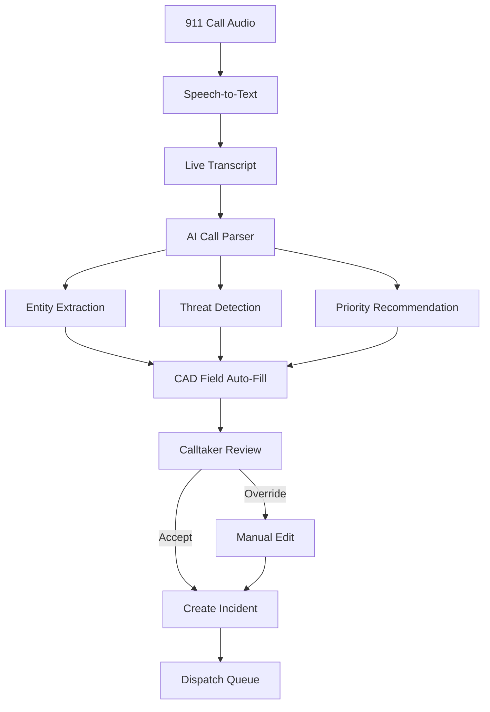

# MDT Platform — AI Call Parsing Workflow



## Pipeline Stages

### 1. Speech-to-Text
- Provider: Whisper / Azure Speech / AWS Transcribe (stub in `call-parser-service`)
- Real-time streaming with partial results
- Supports English + Spanish (configurable)

### 2. NLP Parsing (`ai-engine/call-parser/app/parser.py`)
Rule-based NLP v1 with LLM upgrade path:
- **Entity extraction:** vehicles, plates, addresses, phones, directions
- **Incident classification:** traffic, medical, weapons, DV, mental health, pursuit
- **Threat indicators:** weapons, medical, DV, suicidal, officer safety
- **Confidence scoring:** per-entity and overall

### 3. CAD Auto-Fill
Parser output maps to incident fields:
```python
cad_fields = {
    "nature": narrative_summary,
    "incident_type": incident_type,
    "priority": priority,
    "location": extracted_location,
    "vehicle": extracted_vehicle,
    "weapons_involved": "weapon" in threat_indicators,
}
```

### 4. Human-in-the-Loop
Calltaker must review AI output before dispatch. All overrides logged for model feedback.

## Example

**Input:**
> "There's a white Ford F-150 speeding northbound on Highway 281 near Evans Road and the driver appears intoxicated."

**Output:**
| Field | Value | Confidence |
|-------|-------|------------|
| Vehicle | white Ford F-150 | 88% |
| Location | Highway 281 near Evans Road | 85% |
| Direction | northbound | 90% |
| Incident Type | traffic (DWI) | — |
| Priority | P2 | — |
| Dispatch Code | 10-55 | — |

## Continuous Learning

Future: override diffs stored in `ai_parse_feedback` table → fine-tune LLM on agency-specific terminology.

## Upgrade Path

Replace `parse_emergency_call()` rule engine with:
1. Local LLM (Ollama) for CJIS air-gapped deployments
2. Azure OpenAI with BAA for cloud deployments
3. Hybrid: rules for high-confidence entities, LLM for narrative
