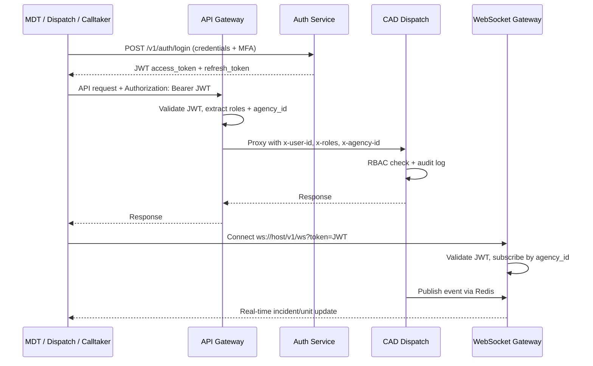

# MDT Platform — Authentication Flow

## Roles & Permissions

| Role | MDT | Dispatch | Calltaker | Admin |
|------|-----|----------|-----------|-------|
| Officer | ✓ | — | — | — |
| Dispatcher | ✓ | ✓ | — | — |
| Calltaker | — | — | ✓ | — |
| Supervisor | ✓ | ✓ | ✓ | — |
| Admin | ✓ | ✓ | ✓ | ✓ |
| System Administrator | ✓ | ✓ | ✓ | ✓ (+ config) |

## MFA Support

Auth service supports TOTP-based MFA. Required for:
- Dispatcher and Calltaker roles (configurable per agency)
- Admin and System Administrator (always required)

## Session Management

- Access token TTL: 15 minutes (configurable)
- Refresh token TTL: 8 hours (shift-aligned)
- Secure, HttpOnly cookies for web clients
- Token revocation via auth service blocklist (Redis)

## Demo Mode

The MDT frontend (`apps/mdt-platform`) includes demo role selection for development without live auth. Production deployments must integrate with the auth service login flow.
