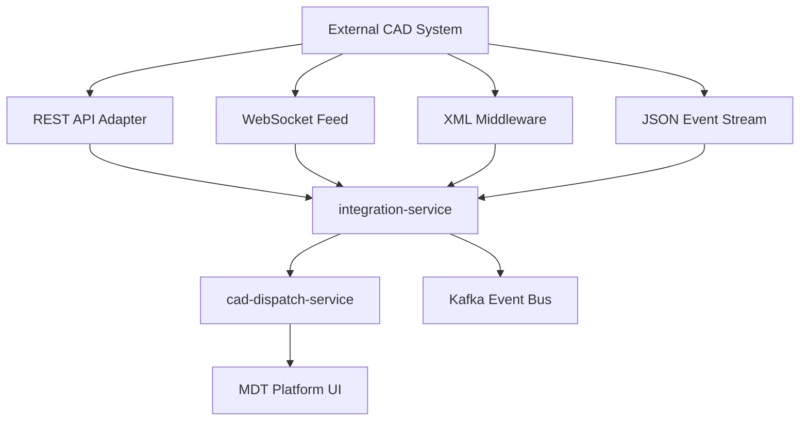

# MDT Platform — CAD Integration

## Integration Methods

The platform supports multiple CAD/RMS integration patterns via the `integration-service` and dedicated connectors.



## Supported Protocols

| Protocol | Direction | Use Case |
|----------|-----------|----------|
| REST API | Bidirectional | Unit status sync, incident CRUD |
| WebSocket | Inbound | Real-time unit AVL, call updates |
| XML feeds | Inbound | Legacy CAD middleware (MarkLogic, etc.) |
| JSON streams | Inbound | Modern CAD event buses |
| NCIC/TCIC | Query | Warrant/vehicle/person lookups (via integration hooks) |

## Example: REST Unit Sync

See `connectors/cad/rest_adapter.py` — polls external CAD for unit positions and upserts to `cad-dispatch-service`.

## Example: WebSocket Event Stream

See `connectors/cad/websocket_adapter.py` — subscribes to external CAD WebSocket and maps events to platform event envelope.

## RMS Export

When an incident is closed in CAD:
1. `cad-dispatch-service` publishes `incident.closed` event
2. `integration-service` transforms to RMS format
3. `rms-service` creates structured incident report for officer completion

## External Agency Interoperability

- Mutual aid unit tracking via shared `agency_id` + `external_agency` flag
- Cross-jurisdiction BOLO sharing through alert-engine federation (future)

## NCIC/TCIC Query Hooks

```python
# Future: integration-service connector
POST /v1/integrations/ncic/query
{ "query_type": "vehicle", "plate": "ABC1234", "state": "TX" }
```

Results displayed in MDT lookup modules without storing NCIC data beyond session.
