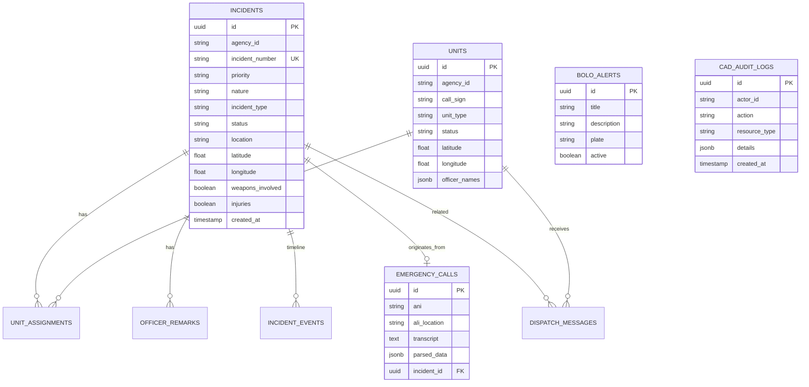

# MDT Platform — Database Schema

## Entity Relationship Diagram

## Tables

### `incidents`
Primary dispatch record. Status flow: `pending` → `dispatched` → `on_scene` → `closed`.

### `units`
Patrol/EMS/K9 units with real-time GPS and status. Status values match MDT buttons.

### `unit_assignments`
Many-to-many between incidents and units with primary unit flag.

### `emergency_calls`
911 call intake records with ANI/ALI, transcript, and AI-parsed JSON.

### `officer_remarks`
Field notes attached to incidents by responding officers.

### `incident_events`
Immutable timeline for audit and supervisor review.

### `bolo_alerts`
Be-On-the-Lookout alerts pushed to MDT clients.

### `dispatch_messages`
Officer ↔ dispatch messaging with broadcast support.

### `warrant_flags`
Active warrant indicators for location/subject alerts.

### `cad_audit_logs`
CJIS-compliant append-only audit trail for all CAD actions.

## Indexes

- `incidents(agency_id, status)` — dispatch queue queries
- `units(agency_id, status)` — available unit board
- `incidents(incident_number)` — unique lookup
- `cad_audit_logs(agency_id, created_at)` — audit retention queries

## Database

- **Development:** PostgreSQL `cad_db` via Docker Compose
- **Production:** PostgreSQL with read replicas, PITR backups, 7-year audit retention
