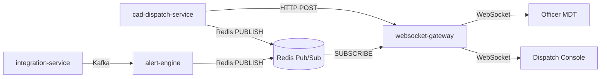

# MDT Platform — Real-Time Event System

## Architecture



## Event Envelope

```json
{
  "type": "unit.assigned",
  "agency_id": "agency-demo-001",
  "timestamp": "2026-05-27T21:00:00Z",
  "source": "cad-dispatch-service",
  "incident_id": "uuid",
  "unit_id": "uuid",
  "call_sign": "1A12"
}
```

## Event Types

| Type | Trigger | Subscribers |
|------|---------|-------------|
| `incident.created` | New incident from calltaker/dispatch | Dispatch, Supervisor |
| `incident.updated` | Priority/status/location change | MDT, Dispatch |
| `unit.assigned` | Unit dispatched to incident | MDT (assigned unit), Dispatch |
| `unit.status` | Officer status button press | Dispatch, Supervisor |
| `unit.emergency` | Silent emergency activated | Dispatch (priority alert), Supervisor |
| `incident.remark` | Officer adds field note | Dispatch |
| `bolo.new` | New BOLO published | All MDT units |

## Redis Channels

- `bluecore.cad.live` — CAD dispatch events
- `bluecore.alerts.live` — Alert engine events (existing)

## Client Integration

```typescript
const ws = new WebSocket(`${WS_URL}?token=${jwt}`);
ws.onmessage = (msg) => {
  const event = JSON.parse(msg.data);
  if (event.type === "unit.emergency") playAudibleAlert();
  refreshIncidentQueue();
};
setInterval(() => ws.send("ping"), 30000);
```

## Offline Sync

PWA service worker caches shell UI. When connectivity returns:
1. Client replays queued status updates via REST
2. Client fetches `/cad/incidents?since=` (future endpoint)
3. WebSocket reconnects and receives live stream
