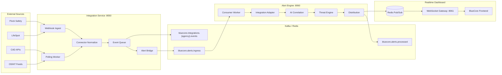

# Platform Event Flow

Live operational events flow from external connectors through the Integration Management Service into the Real-Time Alert Engine and out to dashboard WebSocket clients.



## Message contract

Integration events are wrapped for alert ingress:

```json
{
  "message_type": "integration.normalized",
  "event": {
    "source": "flock_safety",
    "event_type": "flock.plate_read",
    "agency_id": "...",
    "connector_id": "...",
    "occurred_at": "2026-05-27T14:22:00Z",
    "external_id": "read-999",
    "payload": { "plate": "ABC123" },
    "metadata": {}
  }
}
```

## Configuration

| Variable | Service | Purpose |
|----------|---------|---------|
| `ALERT_BRIDGE_ENABLED` | integration | Forward events to alert engine |
| `KAFKA_ALERT_INGRESS_TOPIC` | integration | Target Kafka topic |
| `ALERT_ENGINE_URL` | integration | HTTP fallback |
| `ALERT_BRIDGE_SECRET` | both | Internal HTTP bridge auth |
| `INTEGRATION_BRIDGE_ENABLED` | alert-engine | Accept integration envelopes |

## Test a live flow

1. Start stack: `docker compose up -d` in `deployments/docker`
2. Create connector + send webhook to integration service
3. Event publishes to Kafka ingress → alert engine processes → Redis → WebSocket
4. Open frontend dashboard — alert appears with live WS badge
