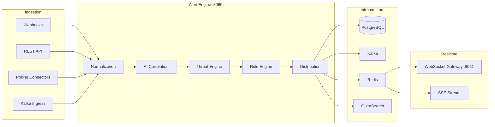

# BlueCore Real-Time Alert Engine

Enterprise microservice for ingesting, correlating, prioritizing, and distributing live operational alerts across public safety data sources.

## Architecture

See [Platform Event Flow](../../docs/platform-event-flow.md) for the live integration → alert → WebSocket pipeline.



## Quick Start

```bash
# Local development
cd services/alert-engine
./scripts/start.sh

# Docker Compose (full stack)
cd deployments/docker
docker compose up -d alert-engine websocket-gateway
```

OpenAPI: http://localhost:8060/docs

## API Endpoints

| Endpoint | Description |
|----------|-------------|
| `POST /v1/ingest/events` | Direct event ingestion |
| `POST /v1/webhooks/{connector_type}` | Webhook ingestion |
| `GET /v1/alerts` | List agency alerts |
| `POST /v1/alerts/{id}/acknowledge` | Acknowledge/escalate/dismiss |
| `GET /v1/stream/live?token=JWT` | WebSocket live feed |
| `GET /v1/stream/sse` | Server-Sent Events feed |
| `POST /v1/analytics/search` | Historical alert search |
| `GET /metrics` | Prometheus metrics |

## Roles

Officer, Detective, Dispatcher, Supervisor, Intelligence Analyst, Administrator — RBAC enforced on all endpoints with agency isolation.

## Threat Levels

LOW → MEDIUM → HIGH → CRITICAL

Officer safety events auto-escalate to CRITICAL with immediate routing to supervisors and dispatchers.
