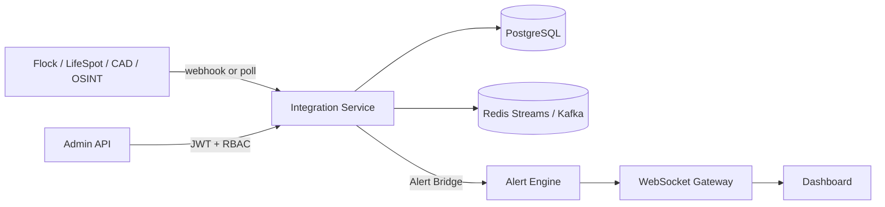

# BlueCore Integration Management Service

Enterprise-grade microservice for external API connectors, webhook ingestion, credential management, and event routing.

## Architecture



See [Platform Event Flow](../../docs/platform-event-flow.md) for the full live pipeline.

## Delivered Components

| # | Component | Location |
|---|-----------|----------|
| 1 | Integration Management Service | `app/main.py` |
| 2 | Connector Framework Base Class | `app/connectors/base.py` |
| 3 | Webhook Ingestion Engine | `app/services/integration.py` |
| 4 | Credential Encryption Service | `app/security/encryption.py` |
| 5 | Connector Registry | `app/connectors/registry.py` |
| 6 | Event Queue Service | `app/services/event_queue.py` + `event_backend.py` + `kafka_backend.py` |
| 7 | Admin Permissions (RBAC) | `app/security/rbac.py` + `app/routers/permissions.py` |
| 8 | Health Monitoring | `app/routers/health.py` |
| 9 | Docker | `deployments/docker/integration.Dockerfile` |
| 10 | Kubernetes | `deployments/k8s/integration-deployment.yaml` |

## Built-in Connectors

| Connector | Auth | Webhooks | Polling | Normalization |
|-----------|------|----------|---------|---------------|
| Flock Safety | API key, OAuth2 | LPR reads | `/v1/reads` | `flock.*` |
| LifeSpot | API key, OAuth2 | Officer alerts | `/v1/alerts/active` | `lifespot.*` |
| Generic CAD | API key, OAuth2, Basic | Incidents | `/incidents/active` | `cad.*` |
| Generic OSINT | API key, OAuth2 | Intel feeds | `/v1/feeds/{id}/entries` | `osint.*` |

All connectors: exponential retry, health reporting, signed webhook verification, OAuth token merge.

## Production Features

- JWT authentication + agency-scoped RBAC
- Agency permission grants enforced on connector access
- Fernet encrypted credential storage + rotate/delete
- OAuth2 token storage merged into connector auth context
- Webhook HMAC signature **required** when secret configured
- Redis Streams (default) or Kafka event backend
- **Alert Bridge** — forwards normalized events to Real-Time Alert Engine (`bluecore.alerts.ingress`)
- WebSocket real-time streaming (`/v1/stream/live?token=JWT`)
- Background polling worker with cursor persistence
- Fleet health checks (`GET /v1/health/fleet`)
- Alembic migrations on startup
- Immutable audit logging
- Prometheus metrics (`/metrics`)

## Quick Start

```bash
chmod +x scripts/start.sh
./scripts/start.sh
```

OpenAPI: http://localhost:8050/docs

## Key API Endpoints

| Endpoint | Description |
|----------|-------------|
| `GET /docs` | OpenAPI documentation |
| `GET /v1/connectors/types` | List connector types |
| `POST /v1/connectors` | Register connector |
| `PATCH /v1/connectors/{id}` | Update / enable / disable |
| `DELETE /v1/connectors/{id}` | Delete connector |
| `POST /v1/connectors/{id}/credentials` | Store encrypted credentials |
| `POST /v1/webhooks/{id}/ingest` | Ingest signed webhooks |
| `POST /v1/connectors/{id}/poll` | Manual poll |
| `GET /v1/health/fleet` | Fleet connector health |
| `GET /v1/events/stream` | Redis/Kafka stream consumer |
| `WS /v1/stream/live?token=JWT` | Real-time events |
| `POST /v1/permissions` | Agency RBAC grants |
| `POST /v1/oauth2/tokens` | OAuth2 token storage |

## Docker

```bash
docker compose -f deployments/docker/docker-compose.yml up integration-service --build
```

## Environment

| Variable | Default | Description |
|----------|---------|-------------|
| `EVENT_BACKEND` | `redis` | `redis` or `kafka` |
| `KAFKA_BOOTSTRAP_SERVERS` | `localhost:9092` | Kafka brokers |
| `INTEGRATION_DB_URL` | sqlite local | PostgreSQL in prod |
| `RUN_ALEMBIC_ON_STARTUP` | `true` | Apply migrations on boot |
